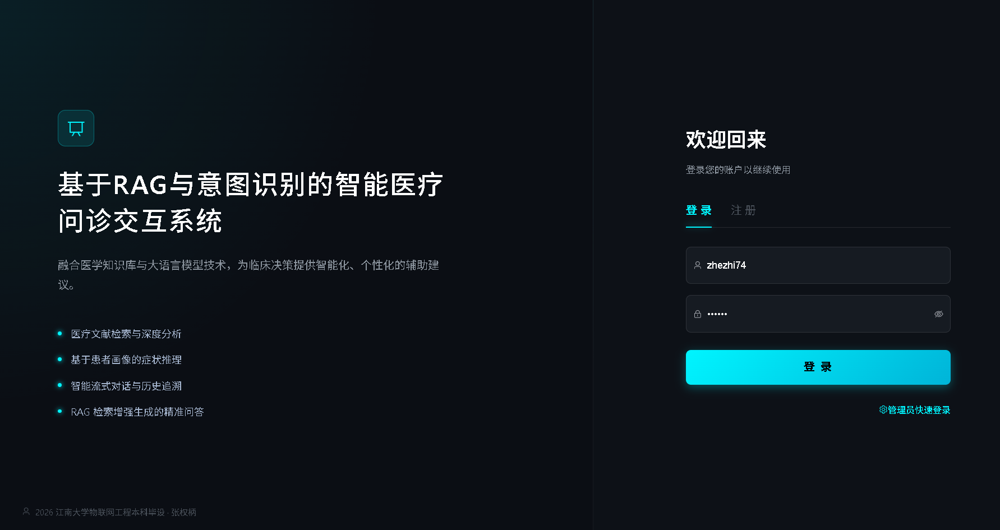
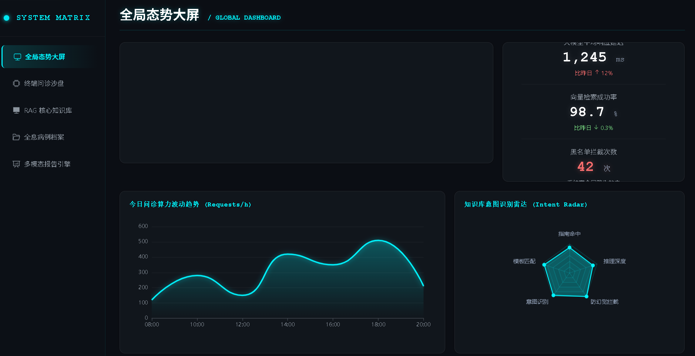
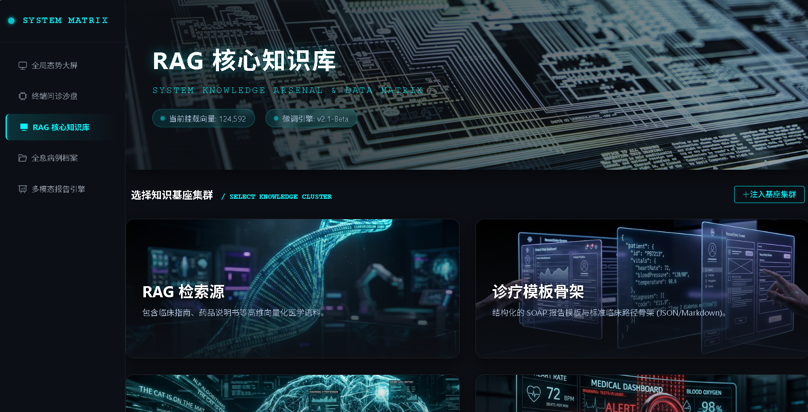
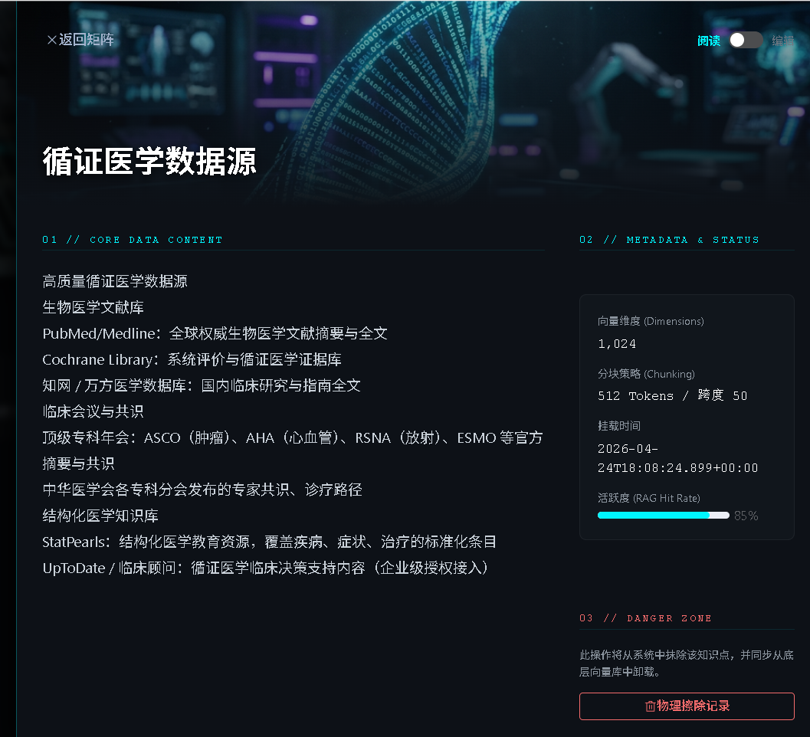
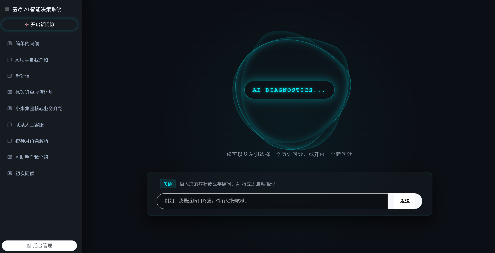
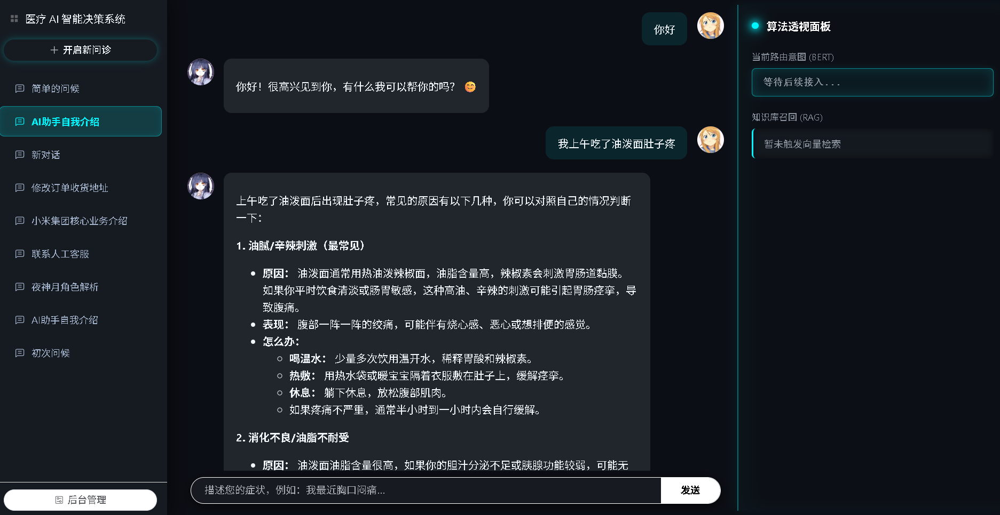
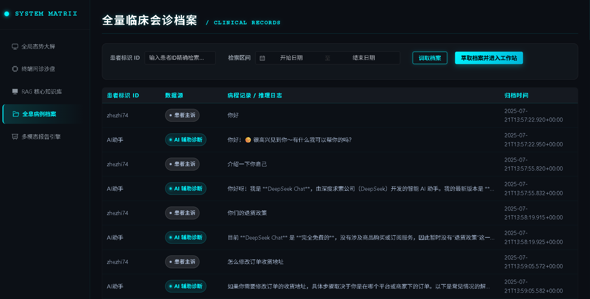
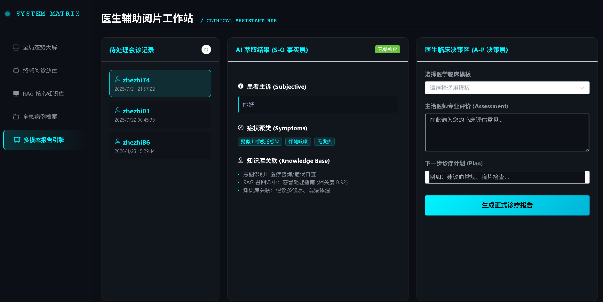
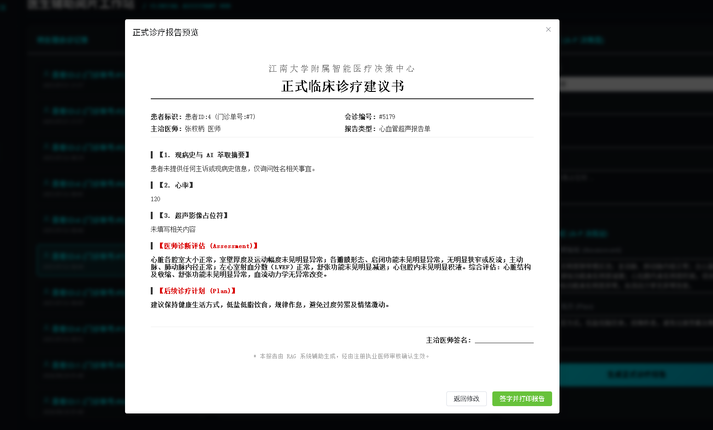

# 基于细粒度意图路由与 RAG 的可靠医疗大模型问诊系统
## Reliable Medical LLM Consultation System Based on Fine-grained Intent Routing and RAG

[](https://spring.io/projects/spring-cloud)
[](https://vuejs.org/)
[](https://deepseek.com/)
[](https://huggingface.co/)
[](https://weaviate.io/)
[](LICENSE)

---

## 🎯 项目愿景与学术创新 (Vision & Innovation)

当前通用大语言模型（LLM）在垂直医疗领域应用时，普遍面临**“意图识别模糊”**与**“致命性医疗幻觉”**两大学术痛点。本项目深度融合了 NLP 传统深度学习与现代生成式 AI 技术，提出并落地了 **Classify-then-Retrieve (先分类后检索)** 的核心防幻觉架构。

通过前置微调的 BERT 模型进行细粒度意图路由，结合 RAG（检索增强生成）与动态思维链 (CoT) 注入，本系统从根本上抑制了大模型的“自信胡说”，实现了从“非结构化医患闲聊”到“结构化 SOAP 标准临床病历”的全自动医学跨越，为大模型在严肃医疗场景的落地提供了可靠范式。

---

## 🧠 核心架构解析 (Core Architecture)

本系统在逻辑上严密划分为“核心算法层”与“工程支撑层”，以算法创新为驱动，以微服务为骨架。

### I. 核心算法层 (Algorithm Core) —— 幻觉抑制的基石
* **BERT 细粒度意图网络**：摒弃了脆弱的大模型 Prompt 意图分类，采用基于真实医疗问诊数据集**微调的 BERT 分类器**。结合 **L2 正则化**防止过拟合，精准识别诸如“病情诊断”、“用药建议”、“日常闲聊”等细粒度意图，触发动态路由策略。
* **高维向量检索引擎 (RAG)**：基于 `bge-m3` 模型将用户医疗主诉实时向量化，并在 Weaviate 中执行 Top-K 余弦相似度检索，精准召回权威医疗指南与事实依据，作为大模型推理的“客观锚点”。
* **动态思维链融合 (Dynamic CoT Fusion)**：业界首创的模板融合机制。系统根据前置 BERT 识别出的特定意图，自动匹配并挂载对应科室老医生的**“诊疗思维链模板”**，强制引导 DeepSeek LLM 按照严谨的临床逻辑步骤（S-O-A-P）生成推理回复。

### II. 工程支撑层 (Engineering Infrastructure) —— 云原生微服务底座
基于 **Spring Cloud** 构建高并发、高可用的微服务体系，保障核心算法的稳定调度。
* **四大存储矩阵调度**：
    * **Weaviate 向量库**：存储 RAG 知识库与 CoT 模板的多租户向量数据。
    * **MySQL 关系型集群**：负责动态报告模板元数据以及多轮对话的持久化。
    * **Redis 会话缓存**：维护高速上下文视界，保障多轮并发问诊的极低延迟。
    * **MinIO 对象存储**：承载多模态医学报告。
* **全双工流式引擎**：深度优化 **SSE (Server-Sent Events)** 技术，实现大模型推理过程的极低延迟实时流式输出。
* **基础服务治理**：包含 `gateway-service` 统一路由调度与 `user-service` 基础权限管控，保障系统数据流转的安全与隔离。

---

## 🚀 系统功能展示 (System Modules)

### 00. 医疗终端安全入口 (Auth Portal)
* **无状态安全鉴权**：基于 Spring Security + JWT 的安全鉴权中心，全面保障医疗数据隐私。


### 01. 算力与知识枢纽大屏 (Dashboard)
* **全局态势感知**：实时呈现意图分发漏斗、RAG 向量召回率、知识库吞吐量等算法层核心指标。


### 02. RAG 核心知识库 (Knowledge Base)
* **矩阵化管理**：支持检索源、诊疗模板、意图语料、幻觉黑名单四大集群的原子化管理。



### 03. 智能问诊沙盘 (Intelligent Chat Terminal)
* **意图实时监控**：沙盘侧边栏实时展示当前会话被 BERT 模型捕捉到的细粒度意图概率分布与路由走向。
* **流式响应与溯源**：支持 SSE 实时输出，并在对话末尾自动标注 RAG 检索源引用与文献出处，做到“医出必有据”。



### 04. 历史问诊档案管理 (Consultation Archives)
* **档案持久化与回溯**：系统具备完整的档案持久化与查询能力，支持按时间线精准回溯医患对话细节。


### 05. AI 临床报告引擎 (AI Report Engine)
* **闲聊降噪与事实萃取**：突破传统病历录入限制，利用后台 AI 微服务，将数十轮非结构化的患者闲聊一键降噪，精准萃取为结构化的医学事实层（主诉、现病史）JSON 数据。
* **多模态动态排版**：前端解析 MySQL 预设的临床模板 Schema，根据科室特异性需求，自适应渲染出专属的医师决策（A-P）表单，最终无缝合成符合临床规范的标准电子病历。



---

## ⚙️ 快速启动 (Quick Start)

### 1. 环境准备
确保本机已安装 `Docker`, `Docker Compose`, `JDK 17+`, `Node.js 18+`。

### 2. 启动四大存储矩阵
```bash
cd docker-compose
docker-compose up -d  # 将一键拉起 Weaviate, MySQL, Redis, MinIO
```

### 3. 启动微服务集群 (Backend)
依次在 IDE 中启动以下微服务模块：
1. `gateway-service` (统一网关)
2. `user-service` (鉴权中心)
3. `knowledge-service` (RAG与向量引擎)
4. `chat-service` (对话路由与大模型调度)

### 4. 启动前端工作站 (Frontend)
```bash
cd frontend
npm install
npm run dev
```

---

> **👨‍💻 Author:** Quanbing Zhang 